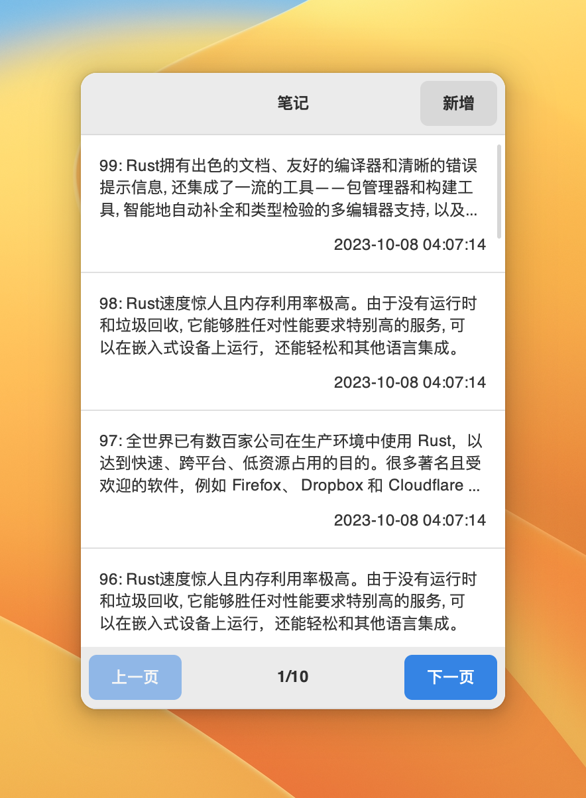

# GTK4-RS-NOTES

使用[gtk-rs](https://github.com/gtk-rs/gtk4-rs/tree/master)以及[libadwaita-rs](https://gitlab.gnome.org/World/Rust/libadwaita-rs)开发，借鉴了[gtk-rs官方出品的Book中的todo示例](https://gtk-rs.org/gtk4-rs/stable/latest/book/introduction.html)。

使用[rusqlite](https://github.com/rusqlite/rusqlite),支持增删改查。这个项目初衷是为了探索Pinephone Pro应用开发而生，所以界面部分主要以移动端为主。目前在Pinephone Pro测试发现，数据量大时，会出现点击列表反应迟钝的现象。对于GTK目前还属于学习初期，所以如果有好的改善，欢迎一起探讨。

### 交叉编译
目前在Monjaro系统上进行交叉编译，主要参考[Cross-compiling](https://wiki.pine64.org/wiki/Cross-compiling#Installing_The_Toolchain)。

遇到的问题已经整理成了一篇文章，详见[为Pinephone Pro交叉编译Rust应用程序
](https://c2lang.com/2023/11/12/cross-compile-rust-applications-for-the-pinephone-pro/)。

### VS Python版
Rust版的性能上并不佳，会有卡顿的现象，于是我又尝试GTK的Python版的绑定，发现在PinePhone Pro上与Rust版一样有卡顿的现象。但是Python版的似乎更加的写起来方便，代码也少一些，性能上并未发现Rust有什么优势，Rust的难学反而成了劣势。